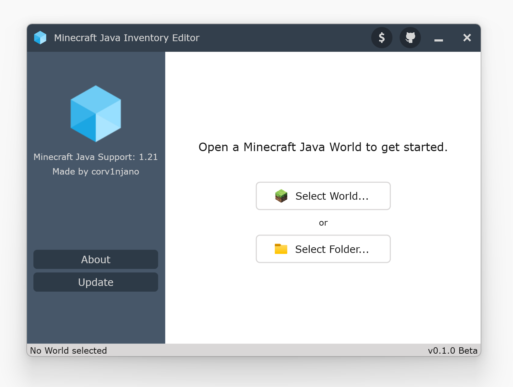

# Minecraft Java Inventory Editor

This software enables you to modify player inventories and Ender Chest contents for any player in a Minecraft world.

This software is currently in development and is expected to be released by April 2025.

## Technical Info

- written in C# .NET 8
- UI Framework: WPF
- uses SQLite for Minecraft Data
